Hospital Analytics 

# 🏥 Hospital Analytics Project

## 📌 Business Problem

Hospital administrators **lack a unified view** of clinical, financial, pharmacy, and operational KPIs due to siloed data systems.
This fragmentation results in:

* ⏱️ Delayed decision-making
* 📉 Inefficient resource allocation
* ⚠️ Reduced service quality
* 🔮 Limited ability to monitor performance or forecast demand across hospital units

---

## 🎯 Business Objective

* **Maximize:** Real-time operational visibility
* **Minimize:** Decision-making delays

---

## ⚙️ Business Constraints

* **Maximize:** System interoperability requirements
* **Minimize:** Data integration complexity

---

## ✅ Success Criteria

* **Business Success:** All 3 core departments (**Finance, Pharmacy, Clinical**) have functional dashboards with real-time KPI access.
* **Economic Success:** ≥30% reduction in manual reporting time → cost savings in administrative overhead.

---

## 📊 Data Used

Exploratory Data Analysis (EDA) and preprocessing were performed on **4 key columns**:

1. **Total Spending**
2. **Total Quantity**
3. **Transaction Count**
4. **Revenue Lost**

# 📊 Exploratory Data Analysis (EDA) with Visuals & Insights

---

## 1️⃣ Univariate Analysis

### Total Spending

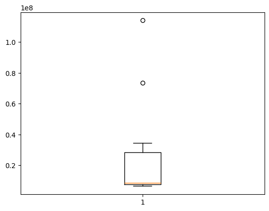

**Insights:**

* Mean: 27.83M | Median: 8.70M | Right-skewed
* Few **high-value transactions dominate spending**
* Indicates **customer inequality** → segmentation required

---

### Total Quantity

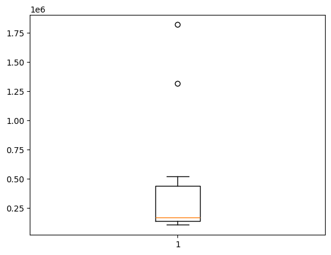

**Insights:**

* Mean: 466K | Median: 167K | Right-skewed
* **Bulk purchases** by few customers inflate averages
* Inventory planning needs **better demand forecasting**

---

### Transaction Count

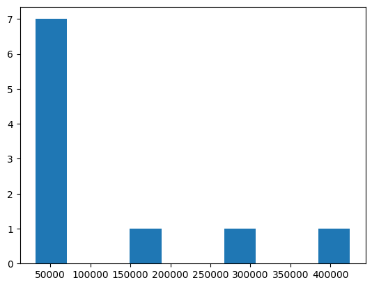

**Insights:**

* Mean: 109K | Median: 33K | Highly skewed
* Most transactions are **small-to-mid**, with outliers driving spikes
* Suggests **different transaction profiles** (retail vs wholesale)

---

### Revenue Lost

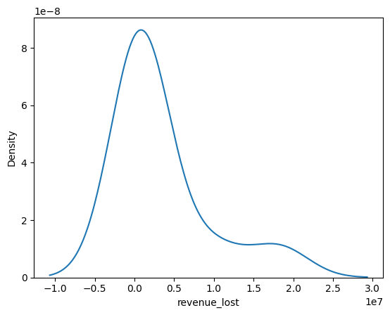

**Insights:**

* Mean: 3.39M | Median: 805K | Very right-skewed
* **Loss concentrated in a few extreme cases**
* Requires **fraud detection & return policy checks**

---

## 2️⃣ Bivariate Analysis

### Spending vs Quantity

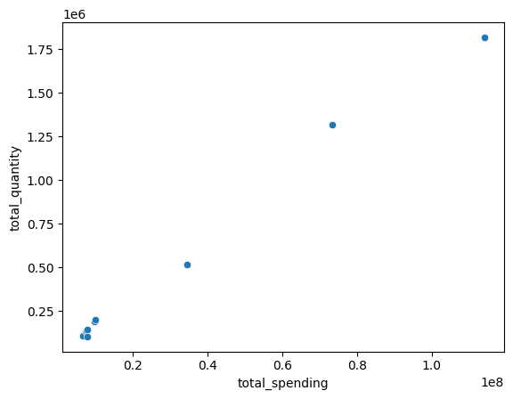

**Insights:**

* Strong positive correlation
* High spenders usually buy in bulk
* **Customer value directly tied to purchase volume**

---

### Revenue Lost vs Quantity

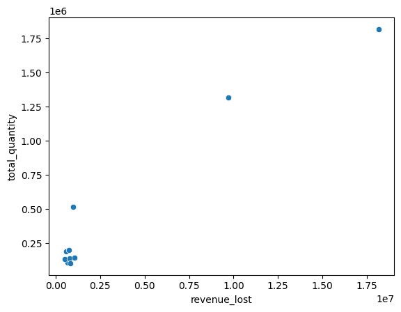

**Insights:**

* Larger orders → higher chance of loss
* Indicates **risk exposure rises with bulk sales**
* Mitigation: stricter checks for **high-value transactions**

---

## 3️⃣ Multivariate Analysis

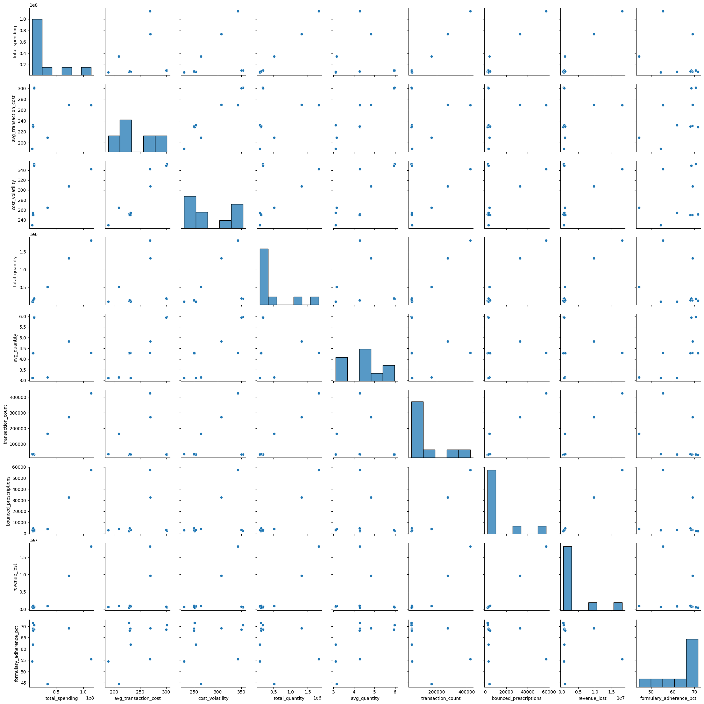

**Insights:**

* Outliers in **spending and quantity strongly influence losses**
* Revenue lost acts as a **risk factor** tied to big-ticket sales
* Suggests **real-time monitoring dashboards** for large orders

after data preprocessing

1) Duplicates
2) Outliers(winsoriation)
3) Missing values

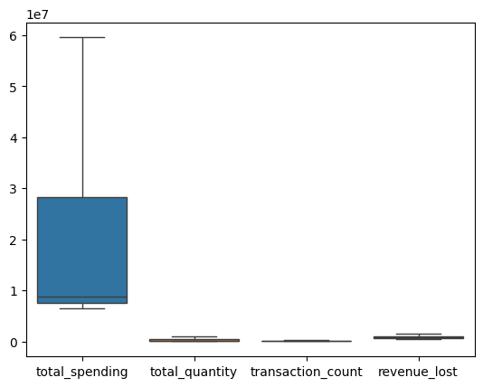
### 📊 Business Insights – `image-9.png`

* The chart highlights **clear clustering with a few extreme outliers**, showing that most customers behave consistently while a small group drives unusual patterns.
* **Revenue and quantity are positively related**, but beyond a threshold, **losses and inefficiencies rise sharply**.
* Indicates a **high dependency on bulk buyers**, who bring both high revenue and high risk.

# 📊 Exploratory Data Analysis (EDA) – Enhanced Hospital Dataset

Dataset Columns:

* **Average Lead Time (days)**
* **Fill Rate (%)**
* **Market Share (%)**

---

## 1️⃣ First Business Moment – Central Tendency

**Average Lead Time (days)**

* Mean: 18.698
* Median: 16
* Mode: 13

**Market Share (%)**

* Mean: 2.487
* Median: 1.6
* Mode: 0.18, 0.68

**Fill Rate (%)**

* Mean: 84.562
* Median: 89.2
* Mode: 70.6, 74.2, 89.7, 91.8, 92.4, 94.1, 94.3, 96.1

---

## 2️⃣ Second Business Moment – Dispersion

**Average Lead Time (days)**

* Variance: 80.484
* Std Dev: 8.971
* Range: 35

**Market Share (%)**

* Variance: 9.692
* Std Dev: 3.113
* Range: 11.6

**Fill Rate (%)**

* Variance: 103.991
* Std Dev: 10.197
* Range: 37.8

---

## 3️⃣ Third Business Moment – Skewness

* **Average Lead Time:** 0.964 → *Right-skewed*
* **Market Share:** 2.003 → *Highly right-skewed*
* **Fill Rate:** -0.597 → *Left-skewed*

---

## 4️⃣ Fourth Business Moment – Kurtosis

* **Average Lead Time:** -0.113 → *Platykurtic (flatter than normal)*
* **Market Share:** 2.997 → *Mesokurtic (near normal)*
* **Fill Rate:** -0.92 → *Platykurtic (light tails)*

---

## 📊 Univariate Analysis

### Average Lead Time (days)

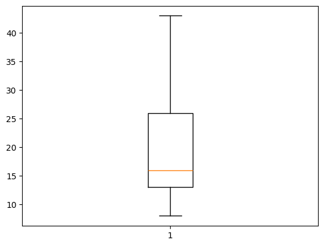

**Business Insights:**

* Most orders are delivered within **10–20 days**, but some take longer → **delays in supply chain**.
* Slight right skew indicates **few orders with very high lead times**.
* Hospitals may face **stock-out risks** if these delays coincide with high demand.

---

### Market Share (%)

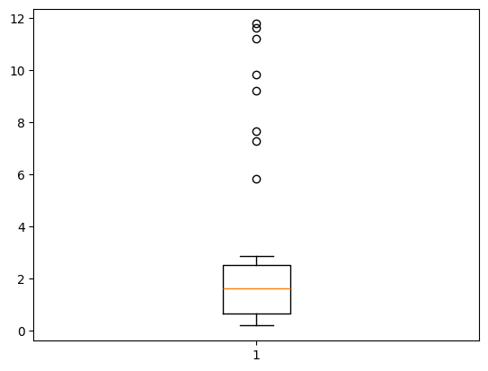

**Business Insights:**

* Majority of hospitals hold **small market shares (<5%)**, while few dominate the market.
* Right skew shows **competitive imbalance**, with concentration in a few big players.
* Strategy: **Smaller hospitals must improve efficiency and partnerships** to stay competitive.

---

### Fill Rate (%)

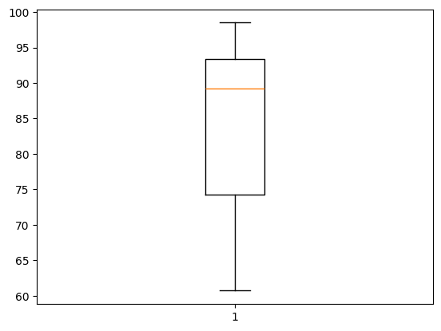

**Business Insights:**

* Most hospitals achieve **80–95% fill rates**, showing generally reliable supply.
* Left skew suggests **some hospitals consistently achieve very high fill rates (>95%)**, setting a performance benchmark.
* Hospitals with lower fill rates (<75%) risk **service delays and patient dissatisfaction**.

# 📦 Exploratory Data Analysis (EDA) – Enhanced Inventory Dataset

Dataset Columns:

* **Current Stock**
* **Max Stock Level**
* **Stock Value**
* **Turnover Rate**

---

## 1️⃣ First Business Moment – Central Tendency

**Current Stock**

* Mean: 42.861
* Median: 43.48
* Mode: 13.41, 15.17, 35.44, 36.19, 51.34

**Max Stock Level**

* Mean: 373.095
* Median: 268.66
* Mode: 68.85, 73.41, 131.97, 162.80, 188.71, 262.51

**Stock Value**

* Mean: 2455.545
* Median: 1521.29
* Mode: 1162.05

**Turnover Rate**

* Mean: 63.662
* Median: 35.76
* Mode: 5.07, 8.13, 8.77, 9.17, 9.42, 9.53, 11.29, 13.27, 14.59, 14.94

---

## 2️⃣ Second Business Moment – Dispersion

**Current Stock**

* Variance: 486.996
* Std Dev: 22.068
* Range: 74.92

**Max Stock Level**

* Variance: 102,471.824
* Std Dev: 320.112
* Range: 2086.14

**Stock Value**

* Variance: 8,199,472.793
* Std Dev: 2863.472
* Range: 21,234.12

**Turnover Rate**

* Variance: 7,256.947
* Std Dev: 85.187
* Range: 789.78

---

## 3️⃣ Third Business Moment – Skewness

* **Current Stock:** -0.035 → *Nearly symmetric*
* **Max Stock Level:** 1.633 → *Right-skewed*
* **Stock Value:** 2.546 → *Highly right-skewed*
* **Turnover Rate:** 3.626 → *Extremely right-skewed*

---

## 4️⃣ Fourth Business Moment – Kurtosis

* **Current Stock:** -1.205 → *Platykurtic (flat)*
* **Max Stock Level:** 0.223 → *Mesokurtic (near normal)*
* **Stock Value:** 8.058 → *Leptokurtic (heavy tails)*
* **Turnover Rate:** 17.071 → *Very Leptokurtic (extreme outliers)*

---

## 📊 Univariate Analysis

### Current Stock

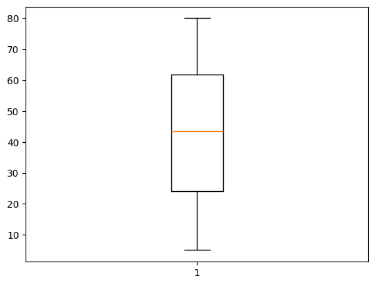

**Business Insights:**

* Stock levels are mostly **centered around 40–45 units**.
* Symmetric distribution → **balanced stock levels without major skew**.
* Helps ensure **stable availability** and lower risk of understocking.

---

### Max Stock Level

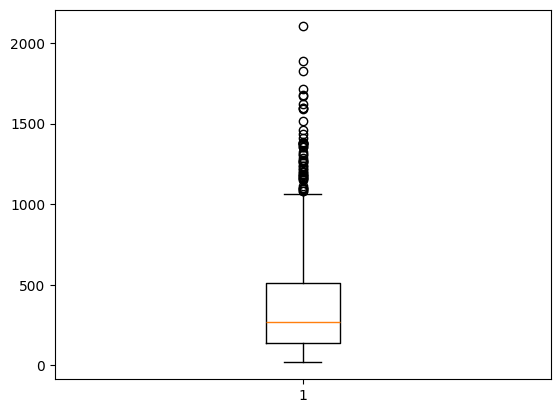

**Business Insights:**

* High right skew shows **few products with extremely high stock capacity**.
* Majority of items are capped at **200–400 units**, but some go over **2000 units**.
* Indicates **inefficient stock planning**; excess storage increases carrying costs.

---

### Stock Value

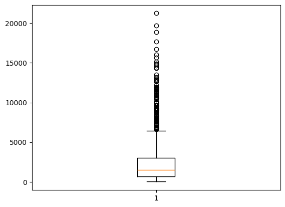

**Business Insights:**

* Strong right skew → **few items have extremely high monetary value**.
* Most items fall under **2000–3000 units in value**, but some exceed **20,000**.
* Suggests **financial risk concentration** in a small set of high-value items.

---

### Turnover Rate

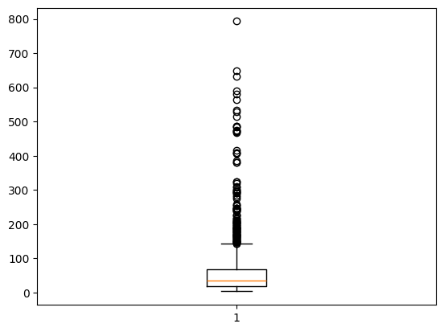

**Business Insights:**

* Extremely skewed with many products having **very low turnover (<20)**.
* A few products show **very high turnover (>500)**, driving efficiency.
* Indicates **stock imbalance**: slow movers tie up capital, while fast movers risk stock-outs.

---

## 🔧 Data Preprocessing Steps

* **Duplicates Removed** – eliminated repeated entries.
* **Winsorization** – handled extreme outliers in skewed variables.
* **Missing Values** – imputed appropriately to maintain dataset integrity.

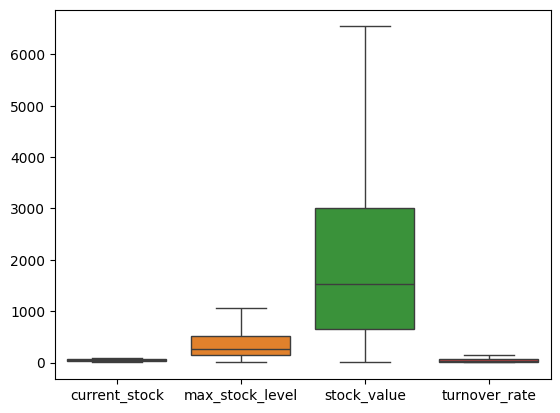

# 🚚 Exploratory Data Analysis (EDA) – Enhanced Supply Chain Dataset

Dataset Columns:

* **Unit Price**
* **Total Value**

---

## 1️⃣ First Business Moment – Central Tendency

**Unit Price**

* Mean: 56.532
* Median: 39.85
* Mode: 43.09

**Total Value**

* Mean: 25,424.139
* Median: 10,019.885
* Mode: 160.42, 406.66, 492.74, 518.35, 631.65, 693.16, 720.73, 912.83, 1105.57, 1125.27

---

## 2️⃣ Second Business Moment – Dispersion

**Unit Price**

* Variance: 2,774.388
* Std Dev: 52.672
* Range: 291.429

**Total Value**

* Variance: 2,224,586,668.144
* Std Dev: 47,165.524
* Range: 978,984.01

---

## 3️⃣ Third Business Moment – Skewness

* **Unit Price:** 1.891 → *Right-skewed (few items with very high prices)*
* **Total Value:** 5.994 → *Extremely right-skewed (majority small orders, few massive ones)*

---

## 4️⃣ Fourth Business Moment – Kurtosis

* **Unit Price:** 3.509 → *Leptokurtic (peaked with some extreme outliers)*
* **Total Value:** 58.388 → *Very Leptokurtic (heavy tails, extreme outliers dominate)*

---

## 📊 Univariate Analysis

### Unit Price

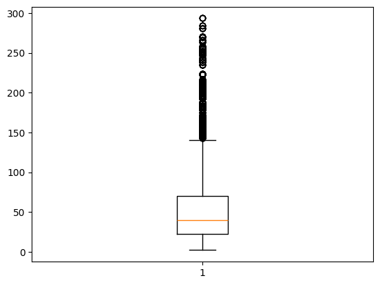

**Business Insights:**

* Most products priced between **20–60 units**, while some go above **250**.
* Strong right skew indicates **luxury/high-cost items** raising the average.
* Suggests **price segmentation strategies** for different customer tiers.

---

### Total Value

**Business Insights:**

* Distribution heavily skewed → **bulk or high-value orders dominate revenue**.
* Majority of orders are small (<20,000), but **a few exceed 900,000+**.
* Indicates **dependency on large buyers**, requiring careful risk management and credit policies.

---

## 🔧 Data Preprocessing Steps

* **Duplicates Removed** – eliminated repeated records.
* **Outliers Treated** – applied winsorization/thresholding for extreme values.
* **Missing Values Handled** – imputed appropriately to ensure consistency.

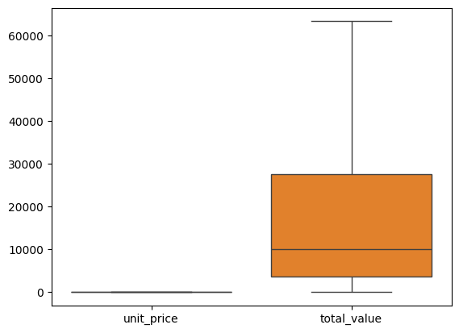

# 🏭 Exploratory Data Analysis (EDA) – Enhanced Supply Chain (Waste Analysis)

Dataset Columns:

* **Actual Unit Price**
* **Waste Value**

---

## 1️⃣ First Business Moment – Central Tendency

**Actual Unit Price**

* Mean: 69.238
* Median: 45.87
* Mode: 7.34, 31.52, 42.78, 60.76

**Waste Value**

* Mean: 2,027.907
* Median: 581.025
* Mode: 3.44, 5.49, 20.33, 26.97, 37.17, 40.85, 68.82, 72.38, 80.46, 87.13

---

## 2️⃣ Second Business Moment – Dispersion

**Actual Unit Price**

* Variance: 4,974.270
* Std Dev: 70.528
* Range: 629.84

**Waste Value**

* Variance: 26,909,564.923
* Std Dev: 5,187.443
* Range: 179,577.28

---

## 3️⃣ Third Business Moment – Skewness

* **Actual Unit Price:** 2.26 → *Strong right skew (few very high-priced items)*
* **Waste Value:** 9.653 → *Extremely right skewed (most waste is small, few cases of massive waste)*

---

## 4️⃣ Fourth Business Moment – Kurtosis

* **Actual Unit Price:** 6.124 → *Leptokurtic (peaked with heavy tails)*
* **Waste Value:** 178.2 → *Very high kurtosis (dominated by extreme outliers)*

---

## 📊 Univariate Analysis

### Actual Unit Price

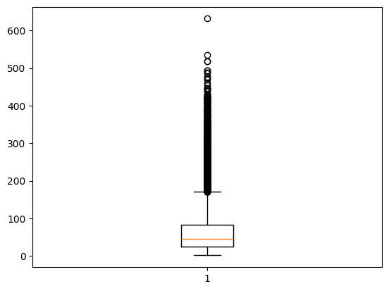

**Business Insights:**

* Majority of products priced below **50 units**, but some exceed **600 units**.
* Indicates **tiered pricing structure** (low-cost essentials vs. premium/rare supplies).
* Hospitals must **negotiate supplier contracts** to control extreme price fluctuations.

---

### Waste Value

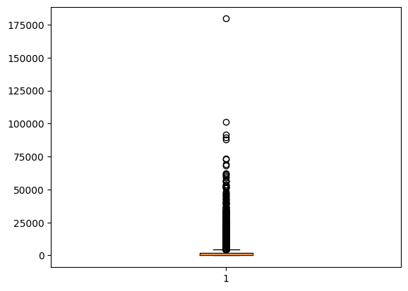

**Business Insights:**

* Most waste is **minimal (<1,000 units value)**, but rare cases show waste above **100,000+**, which drastically skews averages.
* High kurtosis suggests **few catastrophic waste events** drive total losses.
* Action: Implement **waste monitoring systems, better inventory rotation, and stricter expiry control**.

---

## 🔧 Data Preprocessing Steps

* **Duplicates Removed** – Eliminated repeated records.
* **Outliers Treated** – Winsorization applied to extreme waste and price values.
* **Missing Values Handled** – Imputation techniques applied.

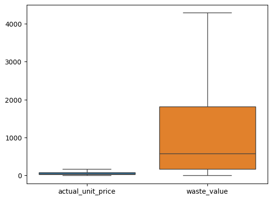

# Enhanced Transaction Dataset (EDA & Preprocessing)

This document summarizes the **Exploratory Data Analysis (EDA)** and **data preprocessing** for the dataset `Enhanced_transaction`.
The dataset contains three primary columns:

* `quantity_consumed`
* `unit_cost`
* `total_cost`

---

## 📊 Exploratory Data Analysis

### **1st Business Moment (Central Tendency)**

**quantity\_consumed**

* Mean: **4.259**
* Median: **3.26**
* Mode: **10**
* *Insight:* Most consumption is small, but mode shows certain items are frequently consumed in bulk.

**unit\_cost**

* Mean: **64.932**
* Median: **42.208**
* Mode: **43.09**
* *Insight:* Prices cluster around 40–45, but mean is higher due to premium items.

**total\_cost**

* Mean: **254.155**
* Median: **138.38**
* Mode: **16.2**
* *Insight:* Most transactions are low-value, but high-value orders raise the average.

---

### **2nd Business Moment (Dispersion)**

**quantity\_consumed**

* Variance: **11.373**
* Std. Deviation: **3.372**
* Range: **24.71**
* *Insight:* Moderate spread, but some extreme values exist.

**unit\_cost**

* Variance: **4306.140**
* Std. Deviation: **65.621**
* Range: **423.366**
* *Insight:* Wide variability in unit cost → mix of low-cost & premium items.

**total\_cost**

* Variance: **96443.328**
* Std. Deviation: **310.553**
* Range: **4115.63**
* *Insight:* Very high spread → occasional very large transactions.

---

### **3rd Business Moment (Skewness)**

**quantity\_consumed** → Skew = **1.844**

* *Insight:* Right-skewed; bulk orders are rare but impactful.

**unit\_cost** → Skew = **1.936**

* *Insight:* Majority of items are low-cost; few expensive items inflate the tail.

**total\_cost** → Skew = **2.736**

* *Insight:* Heavy right skew → most transactions inexpensive, a few very costly ones.

---

### **4th Business Moment (Kurtosis)**

**quantity\_consumed** → Kurtosis = **4.654**

* *Insight:* Leptokurtic → presence of extreme consumption cases.

**unit\_cost** → Kurtosis = **3.637**

* *Insight:* Moderate clustering around typical prices, with occasional outliers.

**total\_cost** → Kurtosis = **11.183**

* *Insight:* Very leptokurtic → rare but extreme high-cost transactions dominate.

---

## 📈 Univariate Analysis

### quantity\_consumed

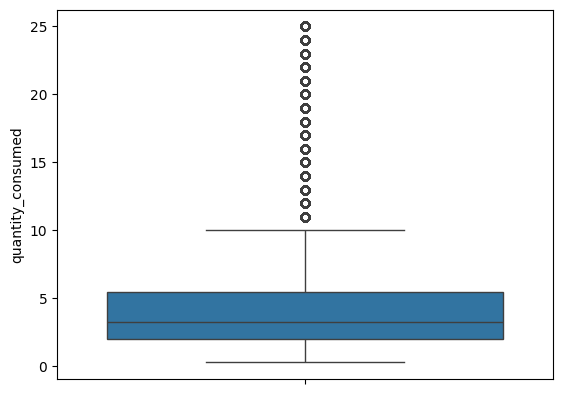
**Business Insight:** Most customers consume small-to-moderate quantities. Bulk consumers can be identified for targeted strategies.

---

### unit\_cost

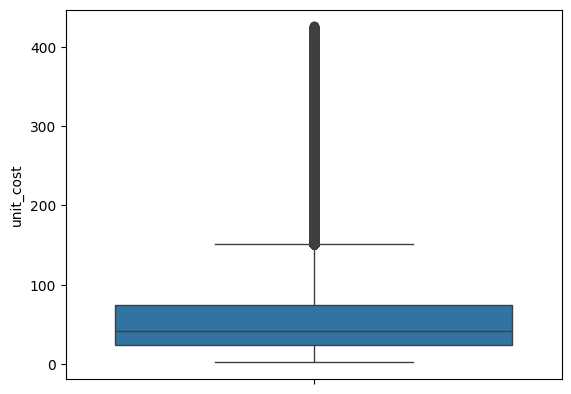
**Business Insight:** Prices are concentrated in a mid-range (40–50). A tiered pricing strategy could capture both budget and premium customers.

---

### total\_cost

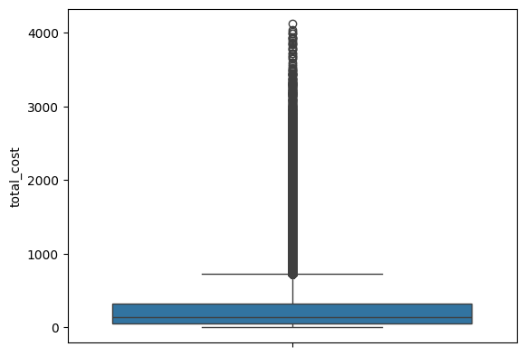
**Business Insight:** Majority of transactions are low-value, but revenue depends heavily on a few high-value transactions.

---

## 🛠️ Data Preprocessing

Steps performed to ensure clean and reliable data:

* **Duplicates:** Removed redundant records.
* **Outliers:** Detected in cost and consumption values → handled to prevent skewing.
* **Missing values:** Addressed to maintain dataset completeness.

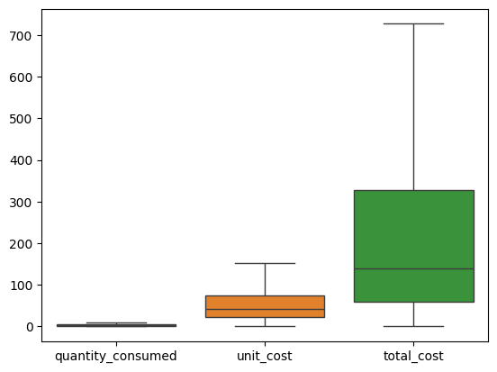

